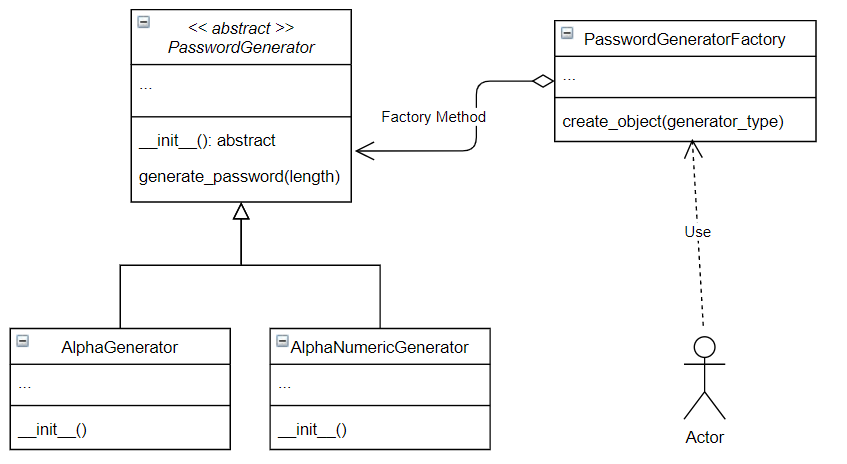

# Factory method
Consider the following class diagram:



**PasswordGenerator**: abstract class that represents password generators

**AlphaGenerator**: subclass of *PasswordGenerator*. Represents password generators based on letters only.

**AlphaNumericGenerator**: subclass of *PasswordGenerator*. Represents password generators based on letters and numbers.

**PasswordGeneratorFactory**: A factory class for creating *PasswordGenerator* objects.

> At any time, run the file **src/main.py** to get an interactive menu to check if your code is behaving properly. 

## Task
- [ ] In the file *src/password_generator_factory.py*, complete the method **create_object(generator_type)** in the class **PasswordGeneratorFactory** so that:
* If the parameter generator_type is equal to `"Alpha"`, create an instance of **AlphaGenerator**
* If the parameter generator_type is equal to `"AlphaNumeric"`, create an instance of **AlphaNumericGenerator**
* Do not forget to process invalid arguments

> Note that the **create_object(generator_type)** is a static method.

To test your code, run the command:
```
python src/check.py
```
